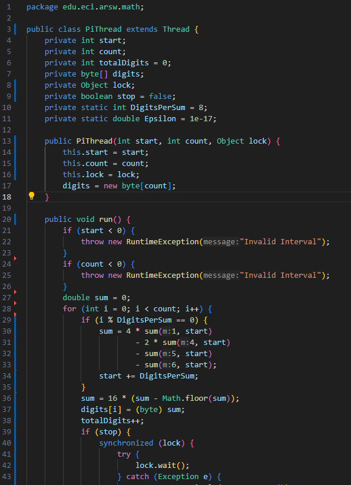
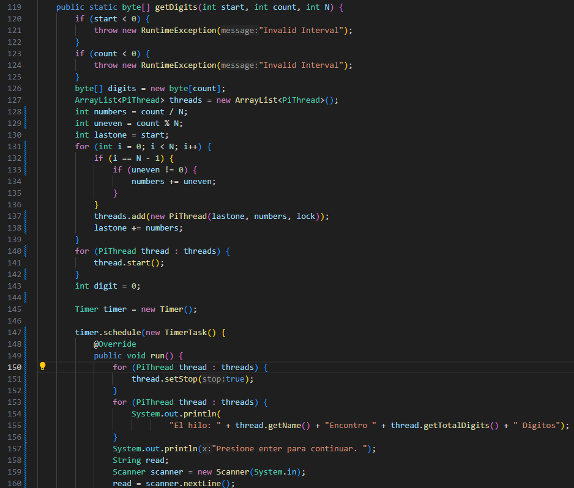
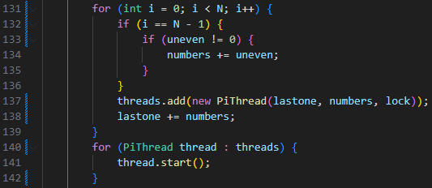
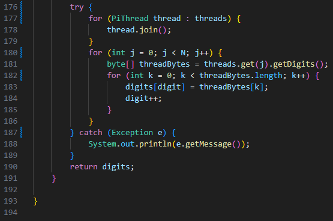
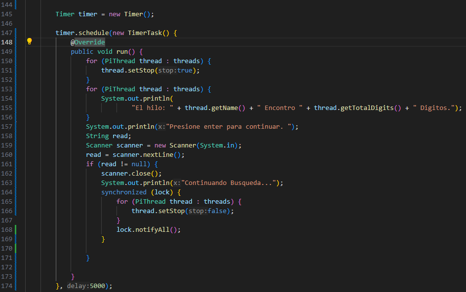
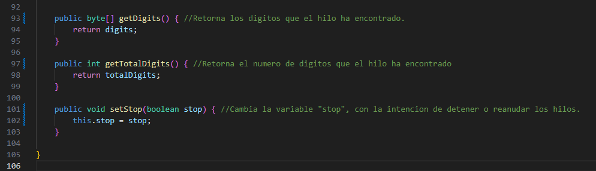
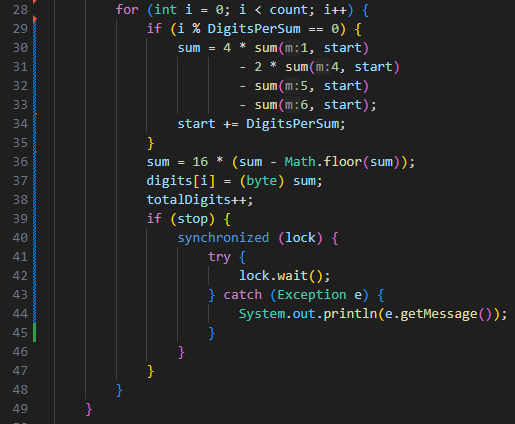
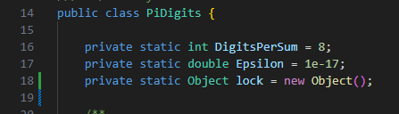
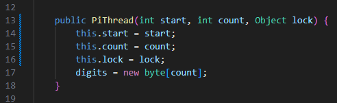

### Escuela Colombiana de Ingeniería
### Arquitecturas de Software - ARSW
## Ejercicio Fórmula BBP - Parcial Practico

**Ejercicio Fórmula BBP**

La fórmula [BBP](https://en.wikipedia.org/wiki/Bailey%E2%80%93Borwein%E2%80%93Plouffe_formula) (Bailey–Borwein–Plouffe formula) es un algoritmo que permite calcular el enésimo dígito de PI en base 16, con la particularidad de no necesitar calcular nos n-1 dígitos anteriores. Esta característica permite convertir el problema de calcular un número masivo de dígitos de PI (en base 16) a uno [vergonzosamente paralelo](https://en.wikipedia.org/wiki/Embarrassingly_parallel). En este repositorio encontrará la implementación, junto con un conjunto de pruebas. 

Para este ejercicio se quiere calcular, en el menor tiempo posible, y en una sola máquina (aprovechando las características multi-core de la mismas) al menos el primer millón de dígitos de PI (en base 16). Para esto

1. Cree una clase de tipo Thread que represente el ciclo de vida de un hilo que calcule una parte de los dígitos requeridos. 

### Explicacion

Para empezar, tomé toda la logica que se encontraba en la clase PiDigits.java y la traslade a mi clase PiThread.java 

 

2. Haga que la función PiDigits.getDigits() reciba como parámetro adicional un valor N, correspondiente al número de hilos entre los que se va a paralelizar la solución. Haga que dicha función espere hasta que los N hilos terminen de resolver el problema para combinar las respuestas y entonces retornar el resultado. Para esto, puede utilizar el método Join() del API de concurrencia de Java. 

Creé una nueva función PiDigits.getDigits() ahora recibe un parametro N que es la cantidad de hilos en los que se quiere dividir el problema. 

 

Podemos ver en la linea 128 que la variable "numbers" es la cantidad de numeros que tiene que calcular cada hilo, en la linea 129 la variable "uneven" calcula si existe un residuo al dividir en partes iguales la cantidad de numeros que calcula cada hilo, y en la linea 130 "lastone" almacena cual fue la ultima posicion en la empezo un hilo. Paso siguiente inicializamos los hilos, usando las variables anteriores configuramos donde empiezan (lastone) y cuantos numeros deben calcular (numbers) y por ultimo los almacenamos en el ArrayList "threads". 

 

Como vemos en la anterior imagen, si estamos inicializando el ultimo hilo, entonces le agregamos el residuo que resulto de la division con la intencion de calcular todos los digitos requeridos. Para terminar, recorremos el ArrayList donde estan almacenados los hilos y los hacemos correr con el metodo .start(). 

 

Ahora se espera a que cada hilo termine, esto lo podemos ver en el ciclo for de la linea 177 utilizando el metodo .join(). Como cada hilo conserva la logica de PiDigits, entonces, cada hilo almacena sus digitos en una lista de bytes y por lo tanto, podemos pedir esa lista de bytes y colocar cada byte en nuestra lista de nuestro controlador.

Podemos ver en la linea 181 que solicitamos la lista de bytes de cada hilo y luego colocamos los bytes en la lista de nuestro controlador, con el objetivo de presentar la respuesta completa y en orden.

Y por ultimo retornamos la lista del controlador que ya tiene todos los digitos de todos los hilos.

3. Ajuste la implementación para que cada 5 segundos los hilos se detengan e impriman el número de digitos que han procesado y una vez se presione la tecla enter que los hilos continúen su proceso.

Para comenzar es necesario la implementacion de un timer que despues de los 5 segundos todos los hilos se detengan. 

 

Dentro del timer en la linea 150 recorremos el ArrayList donde estan almacenados los hilos y usamos el metodo .setStop() que tiene como parametro un booleano, con el objetivo de avisar a los hilos que deben parar. 

 

Ahora es necesario dentro la clase PiThread definir que sucede cuando el atributo "stop" es "true": 

 

En la linea 39 agregamos un if que verifique si la variable "stop" es "true", seguimos con un bloque sincronizado en la cual como llave para bloquear utilizaremos un Objeto llamado lock que fue inicializado en la clase PiDigits y el constructor de cada hilo fue modificado para recibir esta llave: 

#### Lock:

#### Constructor modificado:

 

Continuando en el bloque sincronizado utilizamos la llave para parar los hilos. Ahora debemos continuar en el timer:

 

Recorremos el ArrayList de los hilos preguntando cuantos digitos han calculado hasta el momento y los escribimos en consola. Acto siguiente, en la linea 159 usamos un scanner para leer la entrada que de el usuario con la intención de continuar. Una vez el usuario haya digitado algo, entonces utilizamos un bloque sincronizado para recorrer el ArrayList de los hilos y cambiamos el valor de la variable "stop" de cada hilo a "false" y por ultimo usamos la llave "lock" y el metodo notifyAll() para reanudar a todos los hilos.

